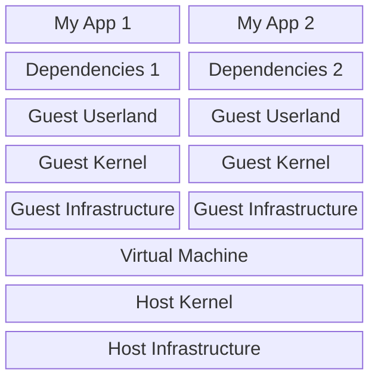
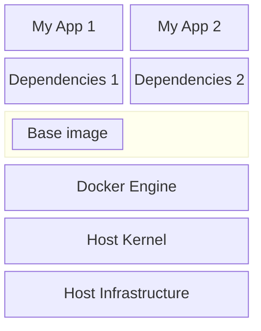
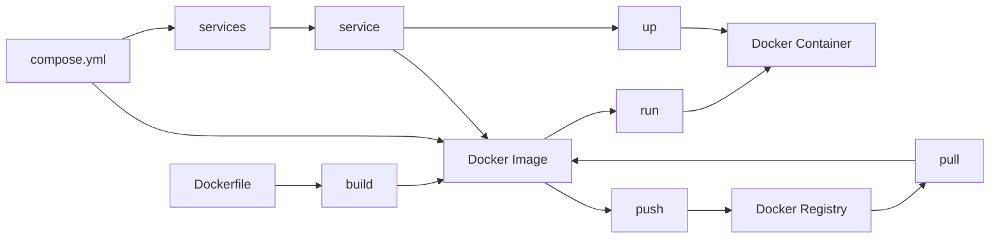
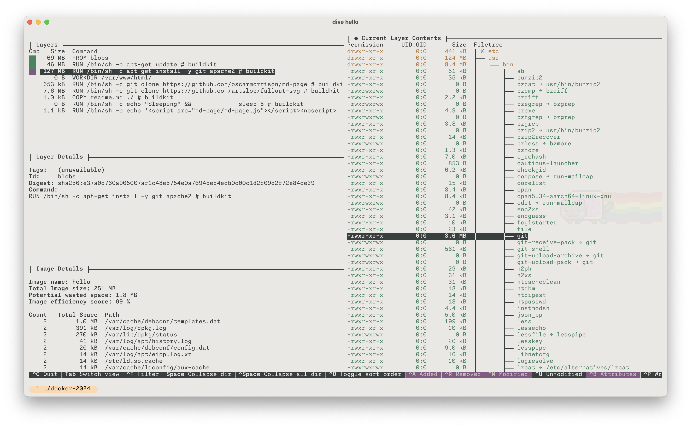
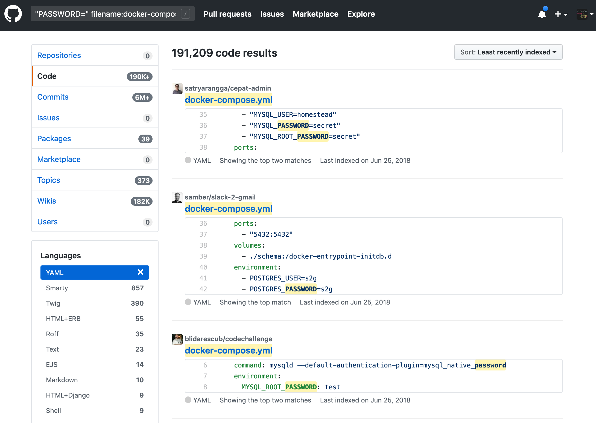
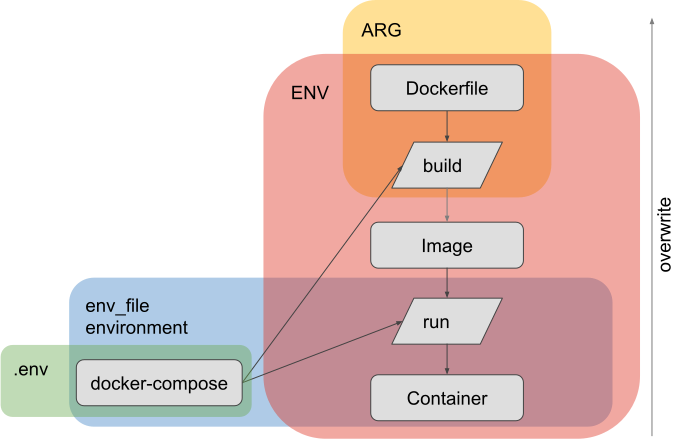

<!-- .slide: data-background="https://images.unsplash.com/photo-1613690399151-65ea69478674?ixlib=rb-4.0.3&q=85&fm=jpg&crop=entropy&cs=srgb&dl=venti-views-1cqIcrWFQBI-unsplash.jpg" data-state="intro"-->

# Docker 2024

Timm Heuss

April 2024

<!-- chapter -->

## What's Docker

---

### Virtual Machine



- Virtualised hardware
- OS kernel and drivers

---

### Docker



- Containers are not running an OS kernel
- Layered, caching file system

---

### Docker Vocabulary



---

### Golden Rules

- Reduce the size of our shipment, because
  - less storage needed
  - better transferring times
  - lower the attack surface
- Reduce build time
  - only fast builds will be executed frequently
- Make builds reproducible
  - nobody has time to debug

<!-- chapter -->

## Docker

Building and running images

---

### Typical file names

```text
Dockerfile
```

---

### FYI: There are things you just have to know 🤨

---

#### Base image defines the package manager

```Dockerfile
FROM ubuntu # -> apt
```

```Dockerfile
FROM alpine # -> apk
```

```Dockerfile
FROM scratch # -> no package manager 
```

---

```Dockerfile
FROM python # -> You cannot tell without looking into it
```

---

#### Some images use tags to indicate their base image


---

```Dockerfile
FROM python:3.13-rc-alpine3.18 # -> alpine -> apk
```

---

```Dockerfile
FROM python:3.13-rc-bookworm # -> ???
```

---

```Dockerfile
FROM python:3.13-rc-bookworm # -> debian version "bookworm"
```

---

```Dockerfile
FROM python:3.13-rc-bookworm # -> apt
```

---

#### Installing properly can be tricky

```Dockerfile
RUN apt update && apt install -y git # YOLO
```

- 👎 No pinned versions
- 👎 keeps the apt cache
- 👎 potentially installs unwanted packages.

```Dockerfile
RUN   apt-get update && \
      apt-get -y install --no-install-recommends \
      git=1:2.25.1 \
      && rm -rf /var/lib/apt/lists/*
```

---

### Hands on

🙌

---

#### Lets start with this Dockerfile

```
FROM ubuntu

RUN apt-get update && apt-get install -y git apache2

WORKDIR /var/www/html/

RUN  git clone https://github.com/oscarmorrison/md-page 
RUN  git clone https://github.com/artslob/fallout-svg

COPY . ./

RUN  echo '<script src="md-page/md-page.js"></script><noscript>' > 'index.html' && \
   cat "readme.md" >> 'index.html'

EXPOSE 80

CMD ["apache2ctl", "-D", "FOREGROUND"]
```

---

### Basic CLI commands

```sh
docker build . -t hello
```

```sh
docker images
```

```sh
docker run --publish 80:80 hello
```

```sh
docker ps
```

```sh
docker stop / kill
```

---

### Dive into it



251MB image

🤔 apt caches, git repos, tons of binaries

---

### `COPY . .`

```Dockerfile
COPY . ./
```

Invalidates cache on every change in the folder.

```Dockerfile
COPY readme.md ./
```

Invalidates cache when `readme.md` is changed.

---

### Introduce Multi-Stage

```Dockerfile
FROM ubuntu as base

FROM base as build
[...]

FROM base as runtime
COPY --from=build /workdir/md-page/md-page.js ./md-page/md-page.js
COPY --from=build /workdir/fallout-svg/vault-boy.svg ./fallout-svg/vault-boy.svg
COPY --from=build /workdir/index.html ./
[...]

```

Distinguish between build and runtime dependencies

---

### We can specify the build target

```Dockerfile
FROM ubuntu as base

FROM base as build
[...]

FROM base as runtime
[...]
```

```sh
docker build . # builds until target "runtime"
```

```sh
docker build . --target build # builds until target "build"
```

---

### Be clever with base images

```Dockerfile
FROM base as build

RUN apt-get update && apt-get install -y git
```

```Dockerfile
from alpine/git as build
```

---

### Be even cleverer with base images

```Dockerfile
FROM base as build

RUN apt-get update && apt-get install -y apache2
```

```Dockerfile
from httpd

WORKDIR /usr/local/apache2/htdocs/
```

---

### Go crazy with base images

```Dockerfile
FROM alpine/git AS git1
[...]

FROM alpine/git AS git2
[...]

FROM ubuntu as build
[...]

FROM httpd
[...]
```

---

### Same funcationality

```sh
hello   latest    b7733e03e9ac   10 minutes ago     178MB

```

178 MB (-30%)

---

### Do we really need apache?

```Dockerfile
FROM joseluisq/static-web-server

WORKDIR /public
```

---

### Optimize Stages and Base Images

scenario | image size (MB) | build time (s)
--- | --- | ---
starting point |  258 | 170
multi-stage, same base images | 178 (-30%) | 2 (-98%)
multi-stage, more suitable base images | 8 (-97%) | 1 (-99%)

reduced build times, reduced waiting times, less resource consumption, lower transferring times, reduced attack surface, ...

---

### Reproducibility - Base Images

```Dockerfile
FROM httpd:2.4.59 AS httpd
FROM alpine/git:2.43.0 AS git
```

---

### Reproducibility - Git

```Dockerfile
WORKDIR /workdir/md-page
RUN     git clone https://github.com/oscarmorrison/md-page . && \
  git reset 36eef73bbbd35124269f5a8fea3b5117cd7a91a3

```

```Dockerfile
WORKDIR /workdir/fallout-svg
RUN  git clone https://github.com/artslob/fallout-svg . && \
  git reset d1dad0950073bdef8cac463f8a87246f45af0ca0

```

---

### Multi-Arch - Why do we care?

[Reminder: We're not simulating hardware in containers](/readme.md#/1/2)

---

### Let Docker decide the arch

```sh
docker pull nxginx
```

Docker pulls `nxginx` with the right CPU architecture for the host, with a fallback to `amd64`

---

### Overriding the architecture

```dockerfile
FROM --platform=linux/amd64 node:18-slim
```

This is useful e.g. for Playwright which has runtime dependencies that are not available for all platforms.

<!-- chapter -->

## Docker Compose

Orchestrating multi-container deployments

---

### Typical file names

```plain
compose.yaml (preferred)
compose.yml
docker-compose.override.yml
docker-compose.override.yaml
docker-compose.yaml
docker-compose.yml
```

---

### Compose our previous example

```yaml
services:
  service:
    build: .
    ports:
      - "80:80"
```

---

#### Example with two services

```yaml [|3,12|3,6,7,12|4,5,13|8-11,14-15|1]
version: 3.2
services:
  app:
    image: 'docker-spring-boot-postgres:latest'
    build: .
    depends_on:
      - db
    environment:
      - SPRING_DATASOURCE_URL=jdbc:postgresql://db:5432/compose-postgres
      - SPRING_DATASOURCE_USERNAME=compose-postgres
      - SPRING_DATASOURCE_PASSWORD=compose-postgres
  db:
    image: 'postgres:13.1-alpine'
    environment:
      - POSTGRES_PASSWORD=compose-postgres
```

---

### Docker Compose in a nutshell

- Essential for multiple services
  - easy execution
  - easy configuration
  - the right abstraction for developers to describe their application

---

### BTW: Compose is now built-in

old

```sh
docker-compose
```

new 🙌

```sh
docker compose
```

---

### BTW: You don't need `version`

```yaml
version: 3.2 # <- optional
services:
  app:
    [...]
```

> The [version property] is [...] for backward compatibility. It is only informative.

<https://github.com/compose-spec/compose-spec/blob/master/04-version-and-name.md>

---

### Scaling made easy

```yaml
services:
  service:
    deploy:
      replicas: 5
```

More on that in my talk:
 <a href="https://heussd.github.io/talk-polyglot-scalable-observable-news-analysis/#/" data-preview-link>
Polyglot | scalable | observable news analysis
    </a>

---

### You can use YAML fragments 😍

```yaml [|1|1,11|2-5,11]
x-build: &build
  x-bake:
    platforms:
      - linux/amd64
      - linux/arm64

services:
  keyword-matcher-go:
    image: ghcr.io/heussd/nats-news-analysis/keyword-matcher-go:latest
    build:
      <<: *build
      context: keyword-matcher-go/.
```

---

### Bind mounts

```yaml
services:
  service:
    build: .
    ports:
      - "80:80"
    volumes:
      - ./folder:/usr/local/apache2/htdocs/folder/
```

Make a folder on your host system available inside the container

---

### Volumes

```yaml [|8-9|6-7,8-9]
services:
  service:
    build: .
    ports:
      - "80:80"
    volumes:
      - cache:/usr/local/[...]
volumes:
  cache:
```

Persist a folder across container executions

---

### RUN-specific mounts

---

```Dockerfile
COPY go.mod go.sum .
RUN go mod download -x
```

- `COPY` just for the package manager
- Package manager caches that might not be persisted

---

```Dockerfile
RUN --mount=type=cache,target=/go/pkg/mod/ \
    --mount=type=bind,source=go.sum,target=go.sum \
    --mount=type=bind,source=go.mod,target=go.mod \
    go mod download -x
```

- No `COPY` just for the package manager
- Package manager caches are persisted across builds

<!-- chapter -->

## Docker bake

Expert Docker building

---

### Typical file names

```text
docker-bake.json
docker-bake.override.json 
docker-bake.hcl (preferred)
docker-bake.override.hcl
```

---

### Example

```hcl
variable "HOME" {
  default = null
}

group "default" {
  targets = ["all"]
}

target "all" {
  platforms = [
    "linux/amd64", \
    "linux/ppc64le"
  ],
  labels = {
      "org.opencontainers.image.source" = "https://github.com/username/myapp"
      "com.docker.image.source.entrypoint" = "Dockerfile"
  }
}
```

```sh
docker buildx bake # build multiple images with all labels
```

<!-- chapter -->
## Secrets

... or just use environment variables, I'm not your boss.

---

### Secrets during build: secret mounts

```sh
docker build \
  --secret id=mytoken,src=$HOME/.aws/credentials \
  .
```

access inside container:

```sh
TOKEN=$(cat /run/secrets/mytoken)
```

---

#### bake is more convenient here

```hcl
variable "HOME" {
  default = null
}

target "default" {
  secret = [
    "id=mytoken,src=${HOME}/.aws/credentials"
  ]
}
```

access inside container:

```sh
TOKEN=$(cat /run/secrets/mytoken)
```

---

### Secrets during runtime

```yaml [|5-7|4,6-7]
services:
  service:
    secrets:
      - mytoken
secrets:
  mytoken:
    file: ./my_secret.txt
```

access inside container:
<!-- .element: class="fragment" data-fragment-index="1"-->

```sh
TOKEN=$(cat /run/secrets/mytoken)
```
<!-- .element: class="fragment" data-fragment-index="1"-->

---

### People seem to prefer environment variables for secrets

---
<!-- .slide: data-background="img/docker-compose-passwords.png" data-state="intro"-->
---


<!-- chapter -->
## Docker Pitfalls

<!-- .slide: data-background="https://upload.wikimedia.org/wikipedia/en/a/a4/Hide_the_Pain_Harold_%28Andr%C3%A1s_Arat%C3%B3%29.jpg" data-state="intro"-->

---

### Meanings of `latest`

- `latest` is just a tag, no automation
- `latest` has no common meaning on Docker Hub

```sh
docker pull ubuntu:latest # <- Pulls latest stable LTS
```

```sh
docker pull swaggerapi/swagger-ui:latest # <- Pulls latest nightly
```

---

### Different Runs

`RUN` in Dockerfile

```Dockerfile
FROM ubuntu
RUN whalesay "OMG" # runs code during image build
```

`run` on CLI

```sh
docker run ubuntu # runs a container
```

---

### ENTRYPOINT vs. CMD vs. RUN

| Dockerfile statement | build phase | run phase | purpose |
| --- | --- | --- | --- |
| RUN | ✅ |  | Execute an command, commit result into image  |
| ENTRYPOINT | | ✅ | Specify what to do when container is executed |
| CMD |  | ✅  | Augment ENTRYPOINT with addition parameters |

---

### Arguments vs. Commands

- **`ARGS`** are environment variables during the build phase.
- Runtime **arguments** can be specified using **`CMD`** (`Dockerfile`) or **`commands`** (docker-compose).
- **Docker commands** are command line parameters to the Docker binary (such as `docker images`).

---

### Multi stage targets

```Dockerfile
FROM git as build # <- This is referenced as "target",
                              # not as a "stage"

WORKDIR /workdir

COPY readme.md ./
```

```sh
docker build . --target build
```

---

### Docker build vs. Docker compose build

Respected during image build

```Dockerfile
ENV MSG="Hello world"
RUN echo $MSG
```

Not respected during image build:

```yaml
service:
    environment:
        - MSG="Hello World"
```

---

### ARG vs. ENV vs. .env vs. env_file



---

### The many mounts

| ... Mount | Purpose | Compose | Docker CLI |
| --- | --- |--- |--- |
| Bind mount | Access **external files / folders** | `volumes` | `docker run -v` |
| Bind mount | ... during run | | `RUN --mount=type=bind` |
| Volume mount | Access **internal volumes** | `volumes` | `docker run -v` |
| Secret mount | Access secrets | `secrets` | `docker secret` /  `docker build --secrets`
| Cache mount | Cache some paths for runs | | `RUN --mount=type=cache` |

<!-- chapter -->
## Devcontainers

<!-- chapter -->
## Useful Tools

---

### Dive


Exploring a docker image and layer contents

<https://github.com/wagoodman/dive>

---

### hadolint


Dockerfile linter, validate inline bash

<https://github.com/hadolint/hadolint>

---

### ctop


`top`-like interface for container metrics

<https://github.com/bcicen/ctop>

---

### lazydocker


Terminal UI for both docker and docker-compose

<https://github.com/jesseduffield/lazydocker>

<!-- chapter -->

## Thanks

<https://github.com/heussd/docker-2024>
